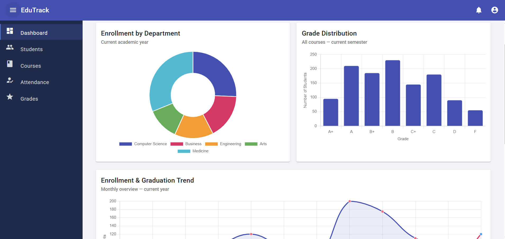

# 🎓 EduTrack — Education Management System

[](https://dotnet.microsoft.com/) [](LICENSE) [](docs/architecture/clean-architecture-overview.md) [](https://martinfowler.com/bliki/CQRS.html) [](https://martinfowler.com/tags/domain%20driven%20design.html) [](https://github.com/mahedee/clean-arch-pro/issues) [](https://github.com/mahedee/clean-arch-pro/actions)

EduTrack is an enterprise-grade education management system built with **Clean Architecture**, **Domain-Driven Design (DDD)**, **.NET 10**, and an **Angular** frontend.



---

## 📋 Table of Contents

- [⚙️ Prerequisites](#prerequisites)
- [🚀 Running the Backend](#running-the-backend)
- [🅰️ Running the Frontend](#running-the-frontend)
- [🧪 Running Tests](#running-tests)
- [🛠️ Developer Guide](#developer-guide)
- [🧰 Technology Stack](#technology-stack)
- [🤝 Contributing](#contributing)
- [📜 License](#license)
- [👨‍💻 About the Maintainer](#about-the-maintainer)

---

## ⚙️ Prerequisites

| Tool | Version | Download |
|------|---------|----------|
| .NET SDK | 10.0+ | [dotnet.microsoft.com](https://dotnet.microsoft.com/download) |
| Node.js | 18+ | [nodejs.org](https://nodejs.org/) |
| Angular CLI | 18+ | `npm install -g @angular/cli` |
| PostgreSQL | 14+ | [postgresql.org](https://www.postgresql.org/download/) |
| Git | latest | [git-scm.com](https://git-scm.com/) |

---

## 🚀 Running the Backend

### 1. Clone the repository

```bash
git clone https://github.com/mahedee/clean-arch-pro.git
cd clean-arch-pro
```

### 2. Configure the database connection

Create `appsettings.Development.json` inside `backend/EduTrack/src/EduTrack.Api/` (this file is git-ignored). Use `appsettings.Production.json` as a template:

```json
{
  "ConnectionStrings": {
    "DefaultConnection": "Host=localhost;Port=5432;Database=EduTrackDb;Username=postgres;Password=yourpassword;"
  }
}
```

> 📖 See [how to configure PostgreSQL with pgAdmin](docs/how-to-configure-postgressql-in-pgadmin.md) if you need help setting up the database.

### 3. Restore packages

```bash
cd backend/EduTrack
dotnet restore
```

### 4. Apply database migrations

```bash
cd backend/EduTrack/src/EduTrack.Api
dotnet ef database update
```

> 💡 If `dotnet ef` is not found, install it: `dotnet tool install --global dotnet-ef`

### 5. Run the API

```bash
cd backend/EduTrack/src/EduTrack.Api
dotnet run
```

| URL | Description |
|-----|-------------|
| `http://localhost:6100` | API base URL |
| `http://localhost:6100/swagger` | Swagger / OpenAPI UI |

**Run with a specific launch profile:**

```bash
dotnet run --launch-profile http        # HTTP only
dotnet run --launch-profile https       # HTTPS + HTTP
dotnet run --launch-profile Staging     # Staging environment
dotnet run --launch-profile Production  # Production environment
```

**Using Visual Studio or VS Code:**

- 🖥️ **Visual Studio:** Open `backend/EduTrack/EduTrack.sln`, select `EduTrack.Api`, and press **F5**.
- 💻 **VS Code:** Open the `backend/EduTrack` folder and use the **Run and Debug** panel (a launch configuration is included in `.vscode/`).

### 🔧 Troubleshooting

| Problem | Fix |
|---------|-----|
| `connection refused` on DB | Ensure PostgreSQL is running and credentials are correct in `appsettings.Development.json` |
| Port 6100 already in use | Change `applicationUrl` in `Properties/launchSettings.json` or stop the conflicting process |
| Pending migrations error | Run `dotnet ef database update` from the `EduTrack.Api` folder |
| `dotnet ef` not found | Run `dotnet tool install --global dotnet-ef` |

---

## 🅰️ Running the Frontend

### 1. Install dependencies

```bash
cd frontend/edutrack-ui
npm install
```

### 2. Start the development server

```bash
cd frontend/edutrack-ui
npm start
```

The app is available at **`http://localhost:4200`**. The dev server proxies API calls to `http://localhost:6100` (backend must be running). Changes to source files are reflected automatically via hot reload.

**Run on a custom port:**

```bash
ng serve --port 4201
```

### 3. Build for production

```bash
npm run build
# or:
ng build --configuration production
```

Output is generated in `dist/edutrack-ui/`.

### 4. Run with Server-Side Rendering (SSR)

```bash
npm run build
node dist/edutrack-ui/server/server.mjs
```

### 🔧 Troubleshooting

| Problem | Fix |
|---------|-----|
| `ng: command not found` | Run `npm install -g @angular/cli` |
| `npm install` fails | Delete `node_modules/` and `package-lock.json`, then re-run `npm install` |
| API calls return 404 or CORS errors | Ensure the backend is running on `http://localhost:6100` |
| Port 4200 already in use | Use `ng serve --port 4201` or stop the conflicting process |

---

## 🧪 Running Tests

### Backend tests

```bash
# Run all tests
cd backend/EduTrack
dotnet test

# Run a specific test project
dotnet test tests/EduTrack.Domain.UnitTests/

# Run with code coverage
dotnet test --collect:"XPlat Code Coverage"
```

📄 See [backend unit tests](docs/backend-unit-tests.md) and [backend test coverage](docs/backend-test-coverage.md) for details.

### Frontend tests

```bash
cd frontend/edutrack-ui

# Run tests in watch mode
npm test

# Run tests headless (CI)
npm run test:ci
```

📄 See [frontend unit tests](docs/frontend-unit-tests.md) and [frontend test coverage](docs/frontend-test-coverage.md) for details.

---

## 🛠️ Developer Guide

### 📁 Project structure

```
clean-arch-pro/
├── backend/EduTrack/
│   ├── src/
│   │   ├── EduTrack.Domain/          # Entities, value objects, domain events
│   │   ├── EduTrack.Application/     # CQRS commands/queries, interfaces
│   │   ├── EduTrack.Infrastructure/  # EF Core, repositories, external services
│   │   └── EduTrack.Api/             # ASP.NET Core Web API
│   └── tests/
│       ├── EduTrack.Domain.UnitTests/
│       ├── EduTrack.Application.UnitTests/
│       └── EduTrack.Api.IntegrationTests/
├── frontend/edutrack-ui/             # Angular application
└── docs/                             # Documentation
```

### 🏗️ Architecture

EduTrack follows **Clean Architecture** with strict dependency inversion — outer layers depend on inner layers, never the reverse.

```
Api  →  Application  →  Domain
Infrastructure  →  Application  →  Domain
```

Key patterns:

- ⚡ **CQRS** with [MediatR](https://github.com/jbogard/MediatR) for all commands and queries
- 🗄️ **Repository + Unit of Work** for data access (no direct DbContext in handlers)
- 📣 **Domain Events** for decoupled side effects
- 🔄 **AutoMapper** for DTO ↔ Entity mapping
- ✅ **FluentValidation** for request validation

📖 See [architecture overview](docs/architecture/clean-architecture-overview.md) for full details.

### ✨ Adding a new feature

Follow these steps to add a new feature using the CQRS pattern:

1. 🧩 **Domain** — Add entity/value objects in `EduTrack.Domain`
2. 📨 **Application** — Create a command or query + handler in `EduTrack.Application`
3. 🗄️ **Infrastructure** — Add repository implementation and EF Core configuration in `EduTrack.Infrastructure`
4. 🌐 **API** — Add controller endpoint in `EduTrack.Api`
5. 🧪 **Tests** — Write unit tests with xUnit + Moq

### 🗄️ Database migrations

```bash
# Add a new migration
dotnet ef migrations add "MigrationName" \
  --project src/EduTrack.Infrastructure \
  --startup-project src/EduTrack.Api

# Apply migrations
dotnet ef database update --project src/EduTrack.Api

# Drop database (development only)
dotnet ef database drop --project src/EduTrack.Api --force
```

### 🔀 Git workflow

```bash
# Create a feature branch
git checkout -b feature/your-feature-name

# Commit with a descriptive message referencing the issue
git commit -m "Add student CRUD operations - Fixes #18"

# Push and open a pull request
git push origin feature/your-feature-name
```

📋 See [CONTRIBUTING.md](CONTRIBUTING.md) and [pull request guidelines](pullrequest-guidelines.md) for the full process.

### 📐 Coding conventions

- **Entities:** singular noun — `Student`, `Course`
- **DTOs:** suffix with `Dto` — `StudentDto`
- **Interfaces:** prefix with `I` — `IStudentRepository`
- **Logging:** structured logging via `ILogger<T>`

---

## 🧰 Technology Stack

### ⚙️ Backend

| Technology | Version | Purpose |
|------------|---------|---------|
| .NET / ASP.NET Core | 10.0 | Web API framework |
| Entity Framework Core | 10.0 | ORM & data access |
| MediatR | 12.x | CQRS & mediator pattern |
| AutoMapper | 12.x | Object mapping |
| FluentValidation | 11.x | Input validation |
| Serilog | 3.x | Structured logging |
| xUnit + Moq | 2.x | Unit testing |

### 🗄️ Database Support

| Database | Status | Use Case |
|----------|--------|----------|
| PostgreSQL | ✅ Primary | General purpose, JSONB support |
| SQL Server | ✅ Supported | Enterprise environments |
| Oracle | ✅ Enterprise | Large enterprise systems |
| SQLite | 🔄 Testing Only | Development & testing |

### 🅰️ Frontend

| Technology | Version | Purpose |
|------------|---------|---------|
| Angular | 18.x | Frontend framework |
| Angular Material | 18.x | UI components |
| TypeScript | 5.x | Type safety |
| RxJS | 7.x | Reactive programming |

---

## 🤝 Contributing

Contributions are welcome. Please read [CONTRIBUTING.md](CONTRIBUTING.md) before submitting a pull request.

### 🎯 How to Contribute

#### 🐛 Report Issues

Found a bug or have a suggestion? Please check existing issues first, then:

- **[🐞 Report a Bug](https://github.com/mahedee/clean-arch-pro/issues/new?template=bug_report.md)**
- **[💡 Request a Feature](https://github.com/mahedee/clean-arch-pro/issues/new?template=feature_request.md)**
- **[📝 Improve Documentation](https://github.com/mahedee/clean-arch-pro/issues/new?template=documentation_improvement.md)**
- **[❓ Ask a Question](https://github.com/mahedee/clean-arch-pro/issues/new?template=general_issue.md)**

#### 🔧 Code Contributions

1. **Fork the repository** and create your feature branch
2. **Follow our coding standards** (see [CONTRIBUTING.md](CONTRIBUTING.md))
3. **Write tests** for your changes
4. **Submit a pull request** following our [PR Guidelines](pullrequest-guidelines.md)

#### 📖 Documentation Contributions

- Improve existing documentation
- Add code examples and tutorials
- Translate documentation to other languages
- Create video tutorials or blog posts

### 🏆 Contributors

Thanks to all the amazing people who have contributed to this project!

<!-- Contributors will be added here automatically -->
<a href="https://github.com/mahedee/clean-arch-pro/graphs/contributors">
  
</a>

---

## 📜 License

Licensed under the **[MIT License](LICENSE)**.

- ✅ **Commercial use** — Use in commercial projects
- ✅ **Modification** — Modify the code as needed
- ✅ **Distribution** — Distribute your modifications
- ✅ **Private use** — Use privately without restrictions
- ⚠️ **Attribution** — Include original license and copyright notice

---

## 👨‍💻 About the Maintainer

**[Mahedee Hasan](https://github.com/mahedee)** — *Software Architect*

- 🏢 **Experience:** 17+ years in enterprise software development
- 🌐 **Website:** [mahedee.net](https://mahedee.net)
- 💼 **LinkedIn:** [linkedin.com/in/mahedee](https://linkedin.com/in/mahedee)
- 🐦 **Twitter:** [@mahedee_hasan](https://twitter.com/mahedee_hasan)

---

<div align="center">

### 🎉 Thank you for choosing EduTrack!

*Building the future of education management, one commit at a time.*

[](https://github.com/mahedee/clean-arch-pro)
[](CONTRIBUTING.md)
[](pullrequest-guidelines.md)

---

**⭐ Don't forget to star the repository if you found it helpful! ⭐**

</div>
